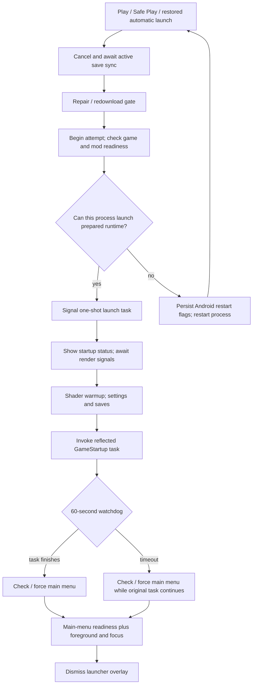

# Launch cycle review — 6 September 2026

Scope: current working tree, including existing uncommitted changes. This is a source review and refactoring proposal; no launch behavior was changed. Findings describe reachable code paths, not device-reproduced incidents.

## Assessment

The main problem is overlapping ownership of startup, recovery, and visibility. There is already a useful attempt-aware handoff state machine, but older task/time-out recovery paths operate outside it. Consolidating those paths matters more than changing timeout values or moving partial classes into fewer files.

The existing identity, runtime-pack authorization, branch-generation, focus, and lifecycle checks are important safeguards. Keep them. Only a small amount of completely unused code was confirmed in this review; much of the apparent clutter is live indirection or compatibility behavior.

## Current route

Sources: `LauncherController.Saves.cs`, `LauncherLaunchCoordinator.StartGame.cs`, `LauncherModel.Launch*.cs`, `LauncherStartupFlow*.cs`, `LauncherGameStartupRecovery*.cs`.

## Findings, in priority order

### 1. High: recovery can run two scene-startup operations concurrently

`LauncherTimeout.cs:56` races the original task against a delay. On timeout, it invokes recovery and returns without cancelling, awaiting, or attaching an explicit late-failure observer to that task.

`LauncherGameStartupRecovery.Watchdog.cs:30` then calls main-menu recovery despite explicitly logging that startup is still running. `LauncherGameStartupRecovery.MainMenu.Force.cs:40` can invoke a second `LoadMainMenu`; that task is also left running if its own timeout expires.

Consequences: late scene replacement, duplicate initialization, and completion after the launcher has reported failure. Increasing the watchdog merely changes when the race becomes possible.

Recommendation: one attempt owns every startup task. If the game API cannot cancel startup, timeout must not authorize another scene load in the same process. Retain/observe the task, invalidate its UI callbacks, and offer a controlled process restart. A compatibility fallback that calls `LoadMainMenu` should only run after the original startup task has definitively finished and the adapter has established that the fallback is valid.

### 2. High: the production readiness callback loses attempt provenance

`Patches/MobileLayoutPatches.cs:37` calls `MarkActiveMainMenuReady()` from the `NMainMenu._Ready` postfix. `LauncherHandoffStateOwner.cs:229` obtains the *currently active* attempt ID, rather than an ID associated with the scene that raised the callback.

The owner rejects explicitly stale IDs correctly. However, if attempt A fails, B becomes active, and an outstanding A scene reaches `_Ready`, this callback supplies B's ID. The state owner cannot distinguish it from B's own readiness. This is a concrete hole in the callback contract; whether a given retry stays in the same process depends on its runtime/restart path.

Recommendation: move this critical readiness hook out of the layout patch into a game-runtime adapter. Bind scene creation/readiness to the originating attempt and scene instance. Require current scene identity and a rendered frame before reporting visible readiness. Never look up a new attempt ID when a delayed completion arrives.

Existing tests exercise explicit stale IDs and the active-attempt helper, but those alone do not prove the actual engine callback preserves provenance.

### 3. High: Android restart failures are reported as successful handoffs

`android/src/com/game/sts2launcher/GodotApp.java:1747` and `:1762` return `void`. If `SharedPreferences.commit()` fails, they log and return without restarting. `LauncherModel.Launch.Restart.cs:81` immediately returns a successful restart result after the void bridge call. The safe-launch path has the same contract problem.

Also, `GodotApp.java:1871` exits the process even when `getLaunchIntentForPackage()` returns null.

Recommendation: return a typed acceptance/failure result across the bridge, including the attempt ID and actionable error. Persist and validate the request and restart target before committing to process exit. Restore the launch controls if the native side rejects the request; do not record `RestartRequested` as accepted merely because the bridge method returned.

### 4. Medium: there is no consistent operation lifetime or timeout policy

`LauncherStartupFlow.StartupContext.cs:61` waits for two process frames and a post-draw signal without a deadline or node-lifetime cancellation. These waits happen before the game-startup watchdog. A missing render signal can therefore leave startup waiting outside that watchdog's coverage.

The 60-second startup timeout uses wall-clock `Task.Delay`; the later handoff visibility wait already uses a monotonic, lifecycle-aware deadline. Backgrounding can consume the former budget while suspending the latter. The forced-load timeout adds a third independently owned wait.

`LauncherController.Saves.cs:266` correctly waits for save-sync cancellation cleanup before launching, but that dependency also sits outside the startup watchdog. Preserve that ordering; surface “Finishing save sync…” and handle a cleanup stall explicitly instead of silently proceeding while saves might still be written.

Recommendation: an attempt-level lifetime, explicit stage budgets, and an injected clock/lifecycle source. Bound waits on engine signals and cancel when their node exits. Choose deliberately which stages count foreground time and which count elapsed time. A timeout outcome must describe what happened to the underlying operation.

### 5. Medium: Play performs synchronous readiness work before returning to the UI

`LauncherLaunchCoordinator.StartGame.cs` directly calls `LauncherLaunchCoordinator.Readiness.cs:16`, which evaluates disk-backed readiness. `GameIdentityReader.cs` includes synchronous file reads and hashing; the PCK cache avoids some work but does not eliminate all I/O.

The impact depends on cache state and device storage. A status update immediately before this work does not guarantee the user sees a painted progress state.

Recommendation: snapshot the selected request, run eligible file/identity work away from the Godot thread, and marshal only engine/UI operations back. Revalidate generation/identity when accepting the prepared result. Do not weaken authorization or trust a cached “ready” flag to make Play faster.

### 6. Medium: restart intent and diagnostic evidence are separate sources of truth

`AndroidPendingLaunchState.java` persists game/safe booleans and handles matching intent extras. `LauncherLaunchCoordinator.Attempt.cs:100` restores the attempt ID from the last-launch marker. Selected branch and startup mode are read through other preferences/markers, including textual phase matching in `LauncherStartupFlow.StartupMode.cs`.

This makes restart reconstruction and stale-state recovery difficult to reason about. Identity validation reduces the risk of launching incompatible files, but does not turn those separate records into one atomic launch request.

Recommendation: one versioned, durable `LaunchRequest` with attempt ID, branch, mode, game identity, runtime-pack identity, and install generation. Persist/claim/consume it with explicit states. Treat timeline and last-launch files as diagnostic output derived from the request, not independent launch instructions. Retain migration and interrupted-write recovery for existing flags.

## Timer inventory

| Current mechanism | Purpose | Proposed treatment |
|---|---|---|
| 60 s game-startup watchdog | Detect stuck `GameStartup` | Keep a bounded policy; stop competing recovery; define background behavior |
| 15 s forced main-menu load | Bound a compatibility fallback | Only permit after original operation ends; observe/cancel late work |
| 15 s visibility confirmation | Wait for menu, foreground and focus | Retain lifecycle-aware deadline and event-driven wakeup |
| Two process frames + post-draw | Let startup status render | Keep actual render evidence; add deadline and node-lifetime cancellation |
| 90 s shader-warmup budget | Bound expensive optional preparation | Retain a separate resource budget; report completion/skip/failure explicitly |
| 45 s shader-warmup warning | Diagnostic progress message | Keep only as progress reporting, not readiness evidence |
| 0.5 s warmup finish delay | Presentation pacing | Remove from critical launch path unless a demonstrated rendering dependency requires it |
| 4 s native intro / 30 s intro watchdog | Cold-launch presentation/fallback | Separate from Play performance; pending game launches already skip the intro |
| Infinite Android startup-task anchor | Deliberately prevent wrapper completion | Characterize and document before changing; not dead code |

The normal success path calls `HoldAndroidStartupTaskAfterObservedAsync`, but the watchdog path returns before that call (`LauncherStartupFlow.GameStartupAttempt.Runner.cs:47`). This is an additional lifecycle inconsistency to characterize on-device. The source establishes that the anchor is intentional; this review did not establish why Android still needs it or what happens if it is removed.

## Confirmed cleanup and things not to delete blindly

Repository-wide symbol searches found no callers for:

- `LauncherWorkshopModSafety.cs`: the class and its four externally callable helpers. Candidate for complete removal; it is adjacent mod-safety code, not the active launch authorization gate.
- `LauncherStartupFlow.StartupMode.PreviousPhase.cs:24`: `DescribePreviousStall`.
- `LauncherStartupFlow.cs:50`: the `StartupLaunchSequence.Launcher` property is assigned but never read; its constructor/forwarding parameter chain is unnecessary.

Live but redundant/misleading:

- `ShaderWarmupSkipStatus` chooses between identical strings.
- `CoverLauncher()` only writes phase/status; actual overlay ownership lives elsewhere. Rename or inline this operation so its name describes its effect.
- Nested `StartupContext → GameStartupAttempt → StartedGameStartup` forwarding layers spread a short control flow across partial files. Consolidate after establishing behavior tests, keeping genuine platform/adapter boundaries.

Not dead:

- `LauncherStartupMarkerText` is an extension-method container; `JoinLines()` is called without naming its class.
- `AndroidMainMenuPreparation` feeds mounted-resource identity into atlas compatibility logic.
- Harmony postfixes and reflected game entry points cannot be classified by ordinary direct-call counts.
- The handoff state/readiness owners, lifecycle monitor, and identity authorization are active safeguards with useful tests.
- The infinite startup anchor and safe-launch markers are live compatibility behavior even if their design should change.

This is a verified shortlist, not a claim that all dead code across the launcher has been exhaustively identified.

## Target design

Use one launch orchestrator with explicit stages: `WaitingForSaveSync → Validating → Preparing → RestartRequested/Starting → WaitingForMenu → WaitingForVisibleFrame → Running`, plus `Failed` and `Cancelled` terminal outcomes. Stages should carry typed results, not infer success from a phase string.

Keep four responsibilities distinct:

1. **Launch request/store:** immutable request identity and restart persistence/consumption.
2. **Launch operation:** owns tasks, stage deadlines, cancellation, errors, and exactly one terminal outcome.
3. **Platform/game adapters:** Android restart acknowledgement, Godot main-thread execution, reflected startup capability checks, and scene-specific readiness.
4. **Presentation/diagnostics:** renders operation state and records structured stage events. UI cannot independently declare success or start recovery.

Reuse the existing handoff state owner for visibility and the existing authorization pipeline for file safety. Do not introduce a second parallel state machine during migration: route old entry points through the new owner and remove the superseded decisions stage by stage.

## Implementation order and acceptance checks

1. Add behavioral coverage for timeout with late completion/fault, stale actual readiness callbacks, and restart rejection. Capture the existing Android lifetime-anchor requirement.
2. Fix task ownership and readiness provenance; prohibit overlapping startup/recovery. Give restart calls explicit results.
3. Introduce the durable request and unified operation lifetime, preserving existing identity and interrupted-install checks.
4. Move eligible readiness I/O off the UI thread; make each waiting stage visible and recoverable.
5. Remove the confirmed unused code and collapse forwarding-only layers. Remove compatibility fallbacks only when their replacement is proven.

Required regression scenarios: normal and safe launch; warm and cold launch; branch/runtime change requiring restart; double Play; save-sync cancellation that stalls; background/lock/resume in each stage; activity recreation; missing render signal; failure then retry with late old scene readiness; timed-out original startup that later completes/faults; restart persistence/intent failure; process death during request consumption; offline launch; shader-warmup failure; normal versus recovered Android startup wrapper lifetime.

Managed unit tests can cover ordering and contracts, but the actual Godot/Harmony callback and Android restart/process lifecycle need integration/device checks. Passing the current state-owner tests alone does not validate the entire launch cycle.

Validation during this review: `dotnet run --project tests/STS2Mobile.GameIdentityTests/STS2Mobile.GameIdentityTests.csproj -c Release` completed with **121 passed, 0 failed**. No on-device launch/restart reproduction was performed.
