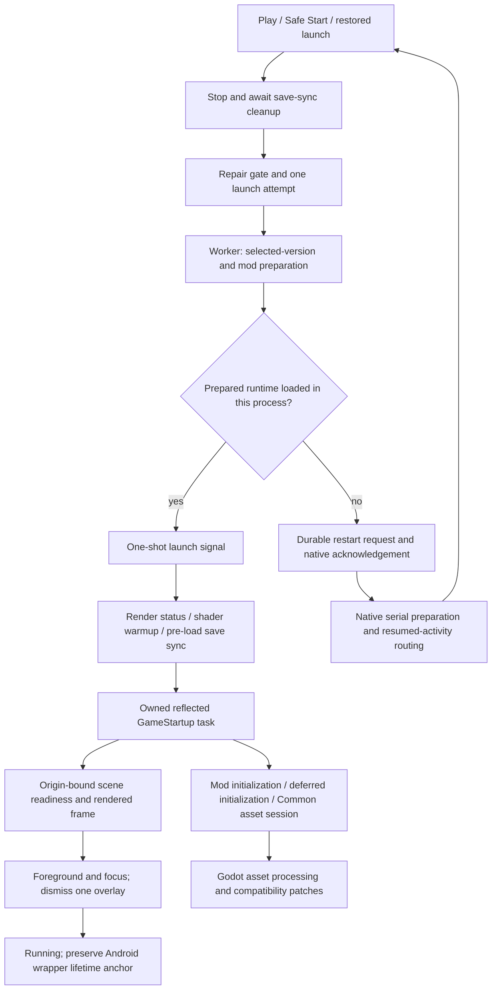

# Launch-flow audit and repair — October 2, 2026

## Purpose and evidence boundary

Investigate the complete visual/input freeze reported after the title screen appears during Modded play. Vanilla has not been tried. The user confirmed the affected phone is unavailable for this run. Local regressions can prove individual defects and repairs; they cannot identify the phone's blocked thread or establish that its intermittent freeze is resolved.

This source directory has no Git metadata. Baselines and command output are retained in `tmp/launch-audit-20261002/`. The implementation repairs existing owners and patches rather than adding a launch controller, watchdog or recovery system.

## Current launch flow

## Ownership inventory

| Stage | Current authority and execution | Lifetime, persistence and completion | Disposition |
| --- | --- | --- | --- |
| Play, Safe Start, automatic launch | Controller → `LauncherLaunchCoordinator`; Godot thread | One active request; preparation interaction lock; restored request is consumed once | Retain |
| Save cleanup | Existing shared save service and `LauncherSaveCleanup`; worker cleanup returns to controller | 15-second wait; launch stops if writers have not settled; no overlapping save mutation | Retain |
| File and mod preparation | Existing coordinator; worker work returns to Godot | 60-second foreground stage; expired uncancellable work is drained; game identity/generation revalidated | Retain |
| Native preparation and routing | `LauncherActivity`, `AndroidStartupPreparation`, route gate | Process-wide serial worker; once-only routing on resumed main Looper; destroyed callbacks discarded | Retain |
| Restart | Managed `LauncherRestartRequest` and native restart store | Versioned pending → claimed → consumed request; accepted target required before process exit | Retain |
| First status frame | `StartupContext` → `LauncherStartupStageScope`; Godot thread | Process-frame/post-draw signals; 15-second foreground budget; scene exit/failure ends waits | Retain |
| Shader warmup | `ShaderWarmupScreen`; Godot thread and threaded resource requests | 90-second cooperative deadline, 45-second warning, version-9 marker and presentation TCS; Safe Start skips warmup | Retain |
| Pre-load synchronization and settings | `LauncherStartupFlow.Saves` and shared save service | Worker reconciliation has three-minute cancellation; it settles before Godot-thread `InitSettingsData`; Safe Start pauses automatic Push | Retain |
| Game task | `LauncherStartupOperation` | One uncancellable reflected task; 60-second foreground wait; original task and late faults observed; failed initialization requires restart | Repaired: reserve ownership under lock, invoke external factory outside it |
| Readiness and visibility | Scene binding → `LauncherHandoffStateOwner` | Originating attempt/game/scene plus post-draw, foreground and focus; 15-second visibility stage | Retain authoritative route; remove obsolete active-attempt readiness shortcut |
| Successful Android wrapper | `LauncherGameStartupRecovery` | Intentional infinite pending task after observed startup | Retain |
| Deferred/Common preloading | Actual game `NAssetLoader` serial session and Android preload Harmony patch; Godot thread | Eight outstanding ordinary loads; four ordinary finalizations; four-ms cooperative phase budgets; one synchronous fallback/pass; original session completion and serial VFX | Repaired: replace the uncovered status phase with a budgeted equivalent |
| Mod activation | Existing validated mod plan and `ModLoaderPatches`; original initializer context | Exact selected payloads, script registration, activation evidence and compatibility filters; async manager postfix awaits the original task | Retain behavior; inspect declared preload Harmony owners and ordering constraints after initialization |
| Post-startup diagnostics | Existing recovery scheduler and support-report files | Worker heartbeat at 1/3/10/30/60/120/180/300 seconds; Godot scene sampling at 1/3/10/30 seconds; opt-in full traces; tree-exit cancellation | Repaired: single lightweight writer uses captured storage/branch/attempt and timestamped scene snapshots |

Historical forced-menu recovery and unobserved competing-startup watchdogs were already removed by the September launch refactor. Those historical findings are not current defects. Partial files and the preferences-only `LauncherStartupCoordinator` are not additional startup owners.

## Prioritized findings

1. **P1 — Startup factory under a state lock, repaired.** The two new regressions failed because another thread could not inspect/fail the operation while the factory was executing. Ownership is now reserved atomically, then reflected game code runs without the state lock. Failure during the factory still requires restart, and the original returned task remains observed. Supersedes only the lock-held body of `LauncherStartupOperation.StartGame`.
2. **P1 — Unbudgeted failed threaded loads, repaired.** Eight valid resources without threaded requests reproduced eight synchronous fallback loads in one pass of the real game class. The added status prefix supersedes the original `AssetLoadingSession.CheckLoadingStatus` loop on Android. It retains status rotation, cache and loaded-count accounting, failed-asset marking and eventual completion, and returns after one fallback. Request/finalization prefixes and serial VFX remain intact.
3. **P2 — Captured-context diagnostics, repaired.** The existing heartbeat failed when the caller's Godot context was left unpumped. Timer continuations now use `ConfigureAwait(false)` and only captured values; live scene sampling stays on Godot. The early probe's duplicate lightweight writer and object-based heartbeat wrapper were removed. The report distinguishes its write time from the last scene sample and explicitly says a worker timer does not confirm rendering/input.
4. **P3 — Unreachable active-attempt readiness shortcut, removed.** Source search found no production callers of `MarkActiveMainMenuReady`. Its historical fixture reproduced stale readiness being credited to a replacement attempt. Fixtures now retain their originating attempt and call the existing explicit `MarkMainMenuReady(attemptId)` owner. The production scene-binding and post-draw contracts remain unchanged.

These are demonstrated source defects and audit cleanup, not an attribution of the reported phone freeze. One synchronous/native resource operation can still block longer than the cooperative budget. No native operation is abandoned, no resource is moved arbitrarily to a worker, and no renderer or mod compatibility rule was introduced.

## Call-site and historical audit

| Path | Inspected call sites and result |
| --- | --- |
| Manual and Safe Start | `LauncherController.ViewEvents.cs:13/22` → `LauncherController.Saves.cs:20/23` → `LaunchAfterSaveSync` → existing repair gate → `LauncherLaunchCoordinator.StartGame.cs:10`. Both share one preparation/attempt owner. |
| Automatic/restored launch | `LauncherController.AutoLaunch.cs:5` uses the same save/repair route. `LauncherLaunchCoordinator.Attempt.cs:37` consumes the durable restored request, then `RestorePending` retains its attempt. |
| Retry/recovery | Controller session retry is authentication retry, not another game task. Handoff recovery returns through `LauncherHandoffStateOwner.Fail` and existing recovery presentation; started failed operations retain the fresh-process requirement. |
| Native restart | `LauncherModel.Launch.Restart.cs:29/41` requests acceptance before finishing the process. `LauncherActivity.java:35/156/204/269` serializes preparation, checks resumed/destroyed ownership and routes once. The native bridge and restart state formats were retained. |
| Reflected game startup | Critical `LauncherPatches` prefix replaces `NGame.GameStartupWrapper` with `LauncherStartupFlow.RunAsync`. `LauncherStartupFlow.GameStartupAttempt.cs:25` invokes `GameStartup` through the single operation; `LauncherStartupFlow.GameStartup.Reflection.cs` checks that reflection returns a Task. No competing game-start call was added. |
| Actual readiness target | `GameSceneReadinessPatches` binds `NMainMenu` at construction because it has no `_EnterTree` override, then observes `_Ready`. `LauncherGameSceneReadiness.TryConfirmRendered` validates originating game/attempt/scene before calling the handoff owner. Historical incorrect `_EnterTree` assumptions do not apply. |
| Actual resource targets | Exact private zero-argument methods `ProcessLoadingQueue`, `FinalizeLoading`, `CheckLoadingStatus`, plus private queue/cache/count fields, were validated against the bundled game assembly and exercised in real Godot. The probe observed all three owned prefixes. |
| Mod ownership | Existing loader signature detection covers legacy void/two-parameter and async Task/three-parameter `ModManager.Initialize`; the async continuation retains ordering. After Android mod initialization, the existing log path prints declared prefix/postfix/transpiler/finalizer records for all three preload targets: owner, method/factory declaration, index, priority, before and after constraints, including missing ownership. It explicitly labels declaration order and never evaluates patch factories to resolve executable methods. It does not change patch priority, repatch mods or treat presence as proof of responsiveness. |
| Intentional compatibility | BaseLib's Android safe initializer and its restricted `CustomBadgesPatch` selection were retained. Full PatchAll/CustomPile exclusions were not widened. The Android `GameStartupWrapper` lifetime anchor remains intentionally pending after successful observation. |
| Existing timeout limits | Stage waits, full scene traces and shader warnings need the Godot context to resume their UI continuations. They cannot preempt a synchronous native/game block. The repaired lightweight timer can persist evidence while that context is stalled; it performs no automatic recovery. |

No persisted launch, save, credential or mod-selection format changed. No second launch owner, progress bridge or watchdog was introduced. The retained recovery presentation, launcher preferences coordinator and partial classes are not parallel game-start owners.

## Validation and candidate

| Check | Result and retained evidence |
| --- | --- |
| Managed regression baseline | 140 original tests pass before repairs alongside the two new failing startup regressions in `managed-red.log`; original source copies under `tmp/launch-audit-20261002/baseline/`. |
| Managed final suite | **145 passed, 0 failed** after the review fix, `dotnet run --project tests/STS2Mobile.GameIdentityTests -c Release --no-restore`; `managed-final.log`. Covers overlapping launch, factory callbacks, timeout/late completion and faults, missing render signals, stale scene readiness, restart rejection and lifecycle/reordered events. |
| Android/JVM regression | **53 tests, 0 failures/errors**, Gradle `testMonoReleaseUnitTest`; `android-unit-fresh.log`, XML results and `android-unit-summary.txt`. |
| Actual resource probe | `scripts/test-asset-preload.ps1 -VerifyBaseline`: original game exceeds the backlog bound; final repaired session loads **161 resources in 44 frames**, maximum four finalizations/eight outstanding; fully cached repeat takes three frames. Fallback fixture completes eight resources including four nested mesh/material scenes and marks one missing resource failed in nine passes. Cache lookup still throws `AssetLoadException` for the failed path. A real Harmony factory fixture proves ownership inspection preserves owner/ordering metadata without invoking the factory again. `asset-final.log`, `ownership-red.log`, `ownership-green-driver.log`. |
| Save/lifetime safety | **12/12** deterministic scenarios, `scripts/test-local-gameplay-save-safety.ps1`; `save-safety.log`. Includes atomic saves, sync-before-load, interrupted transfers, mod/version selection and Android lifetime anchor. Remote fixture does not test live Steam Cloud. |
| Launcher and mod fixtures | Two UI interaction profiles and Vanilla/disabled/active ImportVanillaSaves fixtures pass; BaseLib → dependent fixture → ImportVanillaSaves chain passes. `mod-ui-regression.log`, `baselib-chain.log`. Installed fixture manifests: BaseLib v3.4.7, ImportVanillaSaves v0.2.1; these are not the user's known mod selection. Desktop results do not establish Android mod compatibility. |
| Current game bridge audit | The optional existing `ModManagerCompatibilityTest` passes against the actual installed Steam assembly's async Initialize, State=None and assemblies collection; `current-assembly-compatibility.log`. Its decompiled resource queues/status/failure contract matches the patched bundled phase; `current-AssetLoadingSession.cs`. Reference DLL hashes are in `fixture-hashes.json` and `current-game-hash.json`. This does not identify the user's game version or replace Android execution. |
| Candidate build | Existing `scripts/build-android-local.ps1`, ARM64, version `0.2.433-launch-audit-local`, code `433001`; final rebuild `apk-final-build.log`. A task-local Gradle init/adapter directs generated outputs outside OneDrive after Gradle rejected a preexisting generated cloud placeholder. Production build scripts and source layout were not changed. |
| APK contents/crypto | Release build, ABI/native/managed contents and Android crypto call-site verification passed within the existing build script. |
| In-place update identity | `verify-android-update-compat.ps1` against retained v0.2.432 APK (432002) passes for the final rebuild; `update-final-compatibility.log`. Package `com.sts2launcher.overhaul.fork.local`; signer SHA-256 `FD0E3D5ACF435C1D23BFC5C426E99AA9EB5808619FF1FC214FFCA99CFAC7E57A`. No install, uninstall or data reset performed. |

Unpublished APK: `artifacts/android/StS2Launcher-v0.2.433-launch-audit-local-arm64-v8a.apk`, with adjacent `.sha256`, `.json` metadata and `-evidence.zip`. Final APK SHA-256: `d734cd89f50c1e3ca2b8e0fad94d5d880a04d18ee7f868aba7158e66b29589a6`. The matching package/certificate and increased version code support an in-place update over the retained local v0.2.432 build.

## Final review and decisions

The fresh reviewer found one Important issue and no Critical/Minor issues: Harmony's `GetSortedPatchMethods` can invoke mod factories while resolving methods. A new real-factory regression reproduced that side effect. Inspection now reads declared `Patch` metadata, preserving owner/priority/constraints and stating that executable factories are not evaluated; the regression passes. The source and APK are refreshed after this fix. No second review subsystem or patch sorter was added.

The reviewer declined to infer physical freeze resolution, exact user mod compatibility, a hard bound on native calls or live Steam Cloud behavior. Those limits remain explicit acceptance conditions rather than claims made from local tests.

Decisions: use the supplied workspace and retain baseline/evidence because it has no Git history; finish local source/APK at the user's direction while keeping phone reproduction/acceptance pending; retain cooperative native loading and all existing launch/save contracts. The cost is retained local evidence storage and unresolved device-specific behavior until physical testing.

## Physical-device acceptance — pending at the user's direction

The phone model, Android version, affected APK, game identity, renderer/settings and exact selected mods remain unknown. ADB had no device. Freeze bugreport, logcat and Perfetto capture are pending. The investigation's device exit criterion (reproducible configuration and blocked operation/thread) has not been met.

When the affected ARM64 phone is available, update the matching local channel in place and retain its saves, credentials and selection. Record the missing configuration before changing settings. Alternate five cold launches of the original Modded selection and Vanilla, keeping settings fixed, leaving the title screen for 60 seconds and testing interaction; expand to ten per mode if needed. If only Modded reproduces, isolate dependency-valid groups and verify a suspect against the original selection. Capture continuous logcat, existing timeline/activation/lifecycle reports, an Android bugreport and Perfetto during the stall. Correlate fallback begin/end markers and post-mod Harmony chains with the blocked thread; heartbeat gaps or stale snapshots alone are insufficient proof.

Acceptance still requires 20 successful Modded launches on that phone: ten cold, six warm, two background/resume and two lock/unlock, plus menu interaction, gameplay entry/return, Vanilla startup and preservation of saves, credentials and mod selection. Renderer comparisons and version-specific mod repairs remain conditional on that evidence.

## Later connected-phone follow-up — October 2

The phone became available after this audit and the v434 title-screen freeze was captured before restarting. It exposed a missed preparation/patch interaction: the Android publicizer changes member visibility, while the existing preload patch searched only nonpublic members. Desktop resource validation alone had not exercised that installation boundary. The existing lookup helpers are now repaired through PR #48; the new real-publicizer regression fails before the repair and passes afterward without weakening shape validation. The [preload repair report](title-screen-preload-repair-2026-10-02.md) records the original native wait, candidate APK, current physical acceptance and remaining limits. The earlier unavailable-phone results above retain their original scope.

The first v435 candidate still froze with all three preload prefixes installed.
Matching Mono symbols identify a worker waiting in GC suspension; the engine
render thread waits on the existing canvas shader mutex. An isolated test on
the same Android runtime reproduces the native host remaining GC-unsafe after
first delegate creation. The existing Godot Mono bootstrap now enters native
GC-safe execution at that boundary. Later delegate creation, reverse callbacks
and 64 worker collections pass the same regression. Candidate code `435002`
contains both repairs; its physical acceptance is recorded in the linked report.
